### Hi there 👋

<!--
**AzurIce/AzurIce** is a ✨ _special_ ✨ repository because its `README.md` (this file) appears on your GitHub profile.

Here are some ideas to get you started:

- 🔭 I’m currently working on ...
- 🌱 I’m currently learning ...
- 👯 I’m looking to collaborate on ...
- 🤔 I’m looking for help with ...
- 💬 Ask me about ...
- 📫 How to reach me: ...
- 😄 Pronouns: ...
- ⚡ Fun fact: ...
-->

- :mortar_board: BJTU School of Software Engineering 
- 🔭 Working on [Ice](https://github.com/AzurIce/ice), a Minecraft Cli Helper to manage mods and host servers
- 🔭 Working on [Ranim](https://github.com/AzurIce/ranim), an animation engine implemented in rust, inspired by [3b1b/manim](https://github.com/3b1b/manim) and [jkjkil4/JAnim](https://github.com/jkjkil4/JAnim)
- 🌱 Learning  Rust and Game Dev related things
- ⚡ Skills - Full stack
  - Language: Rust, Golang, Python, C/CPP, Java, JS/TS, ...
  - Frontend Framework: Vue, React, Svelte, Solidjs, ...
- 📫 How to reach me: 973562770@qq.com, azurice@petalmail.com

    
    

### More about myself

  
🎶Music

  
  - ♥️ ACG and Calssical music
  - 🎹 Main instrument: I mainly plays piano, and I'm a Big fan of Animenzzz! Sometimes I upload my performance video to [bilibili](https://space.bilibili.com/46452693)
  - 🎼 Orchestra: I'm playing Double Bass in BJTU Symphony Orchestra
  - A very very little bit: violin, guitar, GuZheng, Bamboo flute, ErHu

  
🎮ACGNM

  
  - Anime:
    - The most important one (As well as the first one): 四月は君の嘘 (Your Lie in April)
    - Favourite ones: ソードアート・オンライン (*Sword Art Online*) **||** 響け！ユーフォニアム (*Sound! Euphonium*) **||** やがて君になる (*Bloom Into You*) **||** ギルティクラウン (*Guilty Crown*) **||** ヴァイオレット・エヴァーガーデン (*Violet Evergarden*) **||** ガールズバンドクライ (*Girls Band Cry*) 
    - Others I like (So many...): EVA, とある科学の超電磁砲 (*A Certain Scientific Railgun*) **||** CLANNAD **||** Love Live **||** BanG Dream! **||** K-ON **||** 少女☆歌剧 Revue Starlight **||** 魔女の旅々 (*Wandering Witch: The Journey of Elaina*) **||** ぼっち・ざ・ろっく！ (*Bocchi the rock*) **||** ウマ娘 プリティーダービー (*Pretty Derby*) **||** ロクでなし魔術講師と禁忌教典 (*Akashic records of bastard magic instructor*) **||** 青春ブタ野郎, ...
  
  - Gaming: Here is my steam profile: [AzurIce](https://steamcommunity.com/id/AzurIce)
    - MMO: Final Fantasy 14 (7.0, Au Ra Dragoon)
    - Survival: Minecraft (Technique player, still a noob), terraria, ...
    - Music: Phigros, MaiMai DX, Quaver, Cytus, ...
    - Otaku: Arknights, Wuthering Wave (AFK), Genshin Impact (AFK)
    - Action: Black Myth Wukong, Nier, Monster Hunter, Warframe
    - Competitive: League Of Legends, APEX Legends
    - Automation: Factorio, Satisfactory, Shapez, ...
    - Resource manage: Oxygen Not Included, Frost Punk, ...
    - Paradox: Stellaris, City: Skylines
    - Yogsothoth's Yard
    - ......

